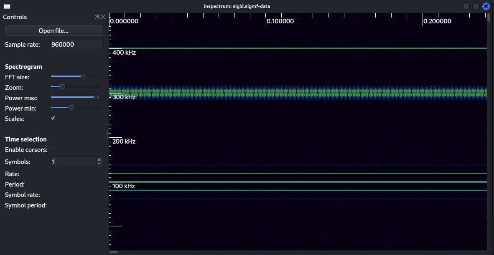
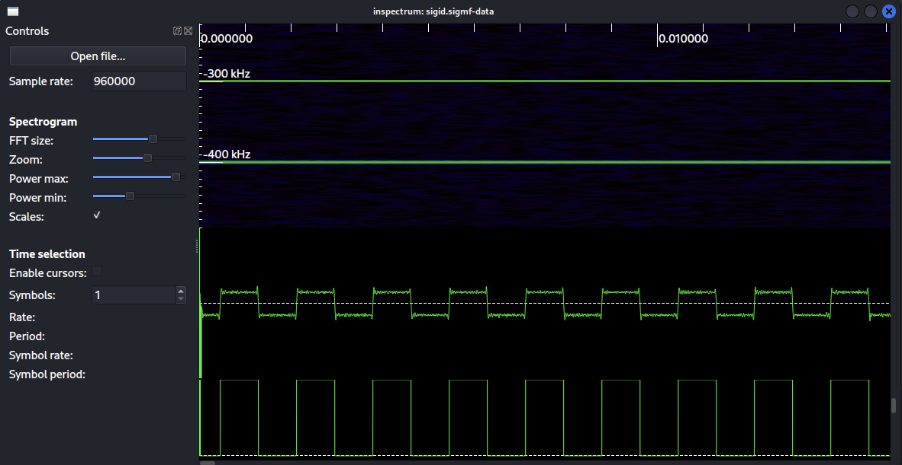
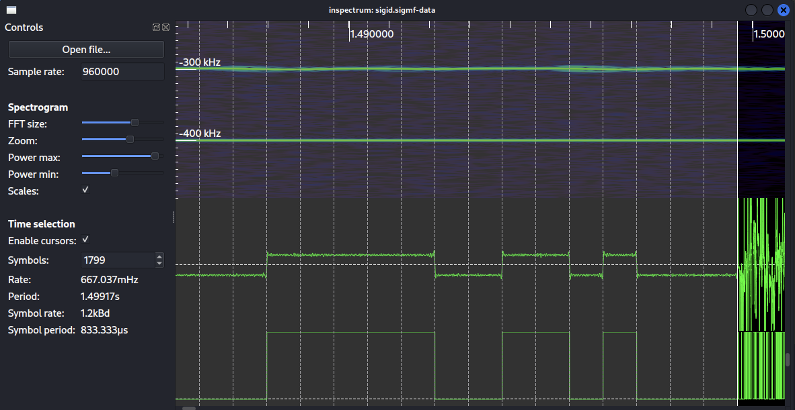

# Challenge 12
I wanted to do this challenge first because I have yet to decode FSK signal.
I took the sigmf IQ data file and put it into [Inspectrum](https://github.com/miek/inspectrum). 
This was my first time using this tool, 
and I wanted to see if I could use it to decode the raw signal.

## Inspectrum

The tool is pretty easy to use. After you load your file you will see a waterfall graph on its side.
This makes it easy to finds things that you are interested in. 
This is how I originally found the signal I wanted to work on, 
but before I could do really anything I needed to set the sample rate.
I was able to find the sample rate from the included metadata file,
and once I did that more options began to unlock. 

Digital Frequency shift keying is where you have one frequency resent a bit and, 
the another frequency represent the opposite bit.
Decoding signals like this is what Inspectrum was designed to handle.
So in the tool I right-click on the 300 KHz range and select *Add derived plot -> Add frequency plot*.
This creates a new plot at the bottom of the tool.
You may need to scroll down to see it. 
Because this is a binary signal you can right-click on that plot and select *Add derived plot -> Add threshold plot.*
This will clear up the signal into ones and zeros.

In the past I have used digital art tools to measure each symbol and convert them into a one or zero,
but this tool has the ability to do this for you.
All you need to do is enable the cursor,
and a column will appear on the screen.
The next step is to use the sizing tools to cover one symbol of the signal. 
It is pretty important to cover the symbol exactly as some signals can have thousands symbols and being off by one pixel can add up.
After setting the symbol length I scroll to the end of signal and start to guess how many symbols are in this signal.
I find there to be 1799 symbols. I can now right-click on column and hit *Extract symbols -> Copy to clipboard.* 

## POCSAG
So after looking at this signal for a while I began to recognize it from a bunch of talks on SDRs. 
I remember seeing a talk about decoding pagers, and they talked about FSK signal that has a long preamble.
I did some quick Google searches and learned that most pagers use the POCSAG protocol. 
I looked up some documentation on it and learned that it had a preamble of 576 alternating frequencies.
The signal that I have just a little more than, but everything else about it looks the same in the diagrams.

With some good confidence that this is POCSAG I continue to read the documentation.
So, after the long preamble there is a frame sync code that is used to state the start of a frame,
and uses the follow sequence 01111100110100100001010111011000.
I took that string of ones and zeros and search the output data from Inspectrum to see if it existed.
Unfortunately no results returned, but in the past I have ran into issues where my bits are flipped, 
so I flip all the ones and zeros and do the search again. This time I get back two results, 
and one of them is right after the preamble. So I know I have a POCSAG signal.

## Decoding
