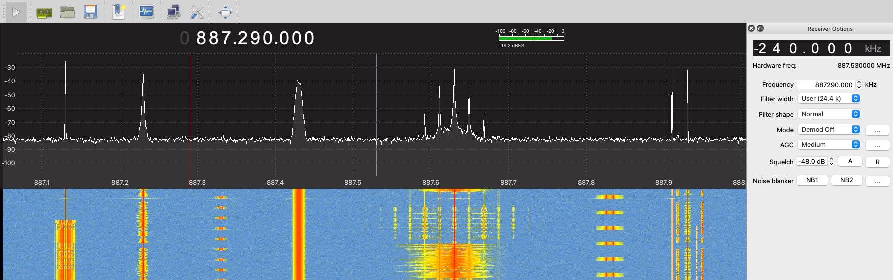
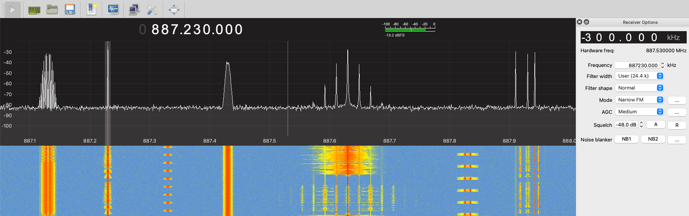
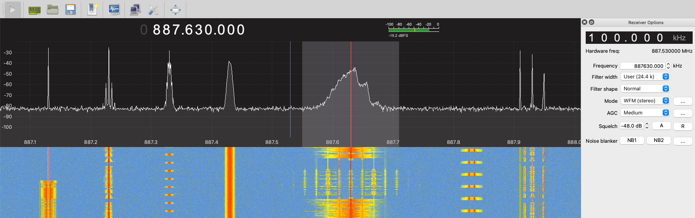
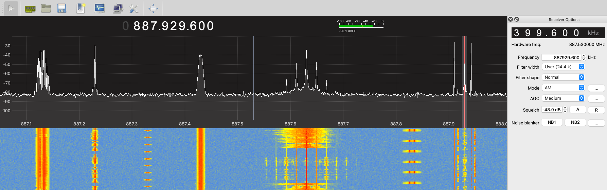

# General
There are a few analog signals that can be extracted just using a basic SDR receiver.
There are plenty different SDR receivers out there.
Some are rich in features and others lacking.
However, I decided to go with GQRX as you can open recordings with it.
Also notice that there are a few audio based flags in the recording so I decided to lump them all together in here

## GQRX
I have been using GQRX to listen some audio signals around me for a while.
It is very easy to use and has good features for that.
However, I have never used it before to listen to recordings.
So I had to learn how to open up as there is no option available when the program is running.
It turns out though opening a file is very simular to opening up a recording in GNU RADIO.
First thing is to setup a source or configure a I/O device, 
and after the new dialog box pops up you can select complex IQ file or Other for the device.
Next for the device string is where put your file, sample rate, and throttle, and after that you can hit okay.

`file=/path/to/file/sigid.sigmf-data,rate=960000,repeat=true,throttle=true`

Once the file is loaded you can begin to uncover each flag.
There are two different ways to focus on a signal of interest
The first is you can enter it in by hand using the frequency bar at the top, or
You can just click on what you are interested in, and it will focus onto that signal.
After that you can change the demodulation around tell you start to hear a voice,
and after that you just need to wait for the flag.

## Challenge 1
This challenge was quite easy. 
If you pay attention to the frequency chart, or the waterfall chart you can spot the FM modulation characteristics.
If you are not familiar with FM modulation the best way to spot it is on a waterfall chart.
As the signal moves down it looks like sound waves.
The other way is in the frequency plot.
To me it looks the signal is dancing around much like a flame does on a candle.
So I set the demodulation to narrowband FM and waited for the flag to be said. 

## Challenge 2
This one has a lot of similarities to Challenge 1.
Except there appears to be three signals instead of just the one, 
but if you look close it just looks like three FM signals.
So, I focused onto that signal and used wideband FM demodulator, and waited for the flag.

## Challenge 5
I am really not sure what this signal was, but it looked like it was an analog signal.
I moved the cursor over to it and clicked on it. 
After that I just started going through the modulations tell I heard a voice.
Once I got to AM I heard a voice I just waited for the flag.

